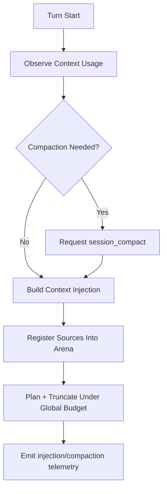

# Journey: Context And Compaction

## Objective

Maintain high-signal context over long-running sessions with one deterministic
runtime path:

- global injection cap (`maxInjectionTokens`)
- pressure thresholds (`compactionThresholdPercent`, `hardLimitPercent`)
- arena SLO (`arena.maxEntriesPerSession`)

Scope note:

- This journey assumes extension-enabled runtime, where `before_agent_start`
  performs context-transform injection.

## Arena Model

- **Append-only**: entries append per session epoch; superseded entries are
  compacted in batches.
- **Deterministic planning**: accepted entries are selected under one global
  budget, then truncated by configured strategy.
- **SLO-backed**: entry ceiling enforces deterministic degradation policy.

## Key Control Loops

### 1) Compaction Loop (Pressure -> Compact -> Reset)

1. Runtime observes context usage each turn.
2. Context budget decides compaction with cooldown + pressure bypass rules.
3. Agent triggers `session_compact` when pressure is high.
4. On compaction, arena epoch and injection dedupe state reset.

### 2) Arena SLO Enforcement

Arena entry count is bounded by `arena.maxEntriesPerSession` (default 4096).
When ceiling is hit, deterministic `drop_recall` degradation fires:

- prefer evicting `memory_recall` / `rag_external`

SLO enforcement emits `context_arena_slo_enforced` with count/drop details.

### 3) External Recall I/O Boundary

External recall is explicit and opt-in:

1. Trigger: internal memory top score < `minInternalScore` and active skill has
   `external-knowledge` tag.
2. Port: runtime calls `externalRecallPort.search()` if custom port is provided.
3. Write-back: only when `[ExternalRecall]` remains in final injected text.

## Memory Injection

Memory engine projects from event tape and publishes working memory.
Injection sources:

- `brewva.memory-working`
- `brewva.memory-recall` (pressure-gated by `memory.recallMode`)
- `brewva.rag-external` (opt-in boundary)

## Key Events

| Event                              | Meaning                                      |
| ---------------------------------- | -------------------------------------------- |
| `context_arena_slo_enforced`       | Arena entry ceiling hit, degradation applied |
| `context_injection_dropped`        | Injection rejected by budget/dedupe rules    |
| `context_external_recall_decision` | External recall final decision summary       |
| `context_compaction_requested`     | Compaction requested by pressure rules       |
| `context_compacted`                | Compaction completed                         |

## Code Pointers

- Arena allocator: `packages/brewva-runtime/src/context/arena.ts`
- Injection orchestrator: `packages/brewva-runtime/src/context/injection-orchestrator.ts`
- Context budget manager: `packages/brewva-runtime/src/context/budget.ts`
- Context service: `packages/brewva-runtime/src/services/context.ts`
- Context pressure service: `packages/brewva-runtime/src/services/context-pressure.ts`
- Context memory injection service: `packages/brewva-runtime/src/services/context-memory-injection.ts`
- Context compaction service: `packages/brewva-runtime/src/services/context-compaction.ts`
- Context external recall service: `packages/brewva-runtime/src/services/context-external-recall.ts`
- Context supplemental budget service: `packages/brewva-runtime/src/services/context-supplemental-budget.ts`
- Memory engine: `packages/brewva-runtime/src/memory/engine.ts`
- Memory retrieval: `packages/brewva-runtime/src/memory/retrieval.ts`
- Context transform hook: `packages/brewva-extensions/src/context-transform.ts`

## Related Journeys

- [Memory Projection And Recall](./memory-projection-and-recall.md)
