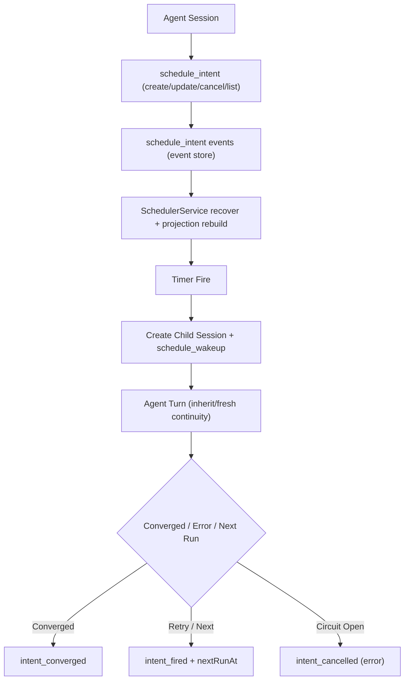

# Journey: Intent-Driven Scheduling

## Objective

Allow agents to declare future execution intent via `schedule_intent`, then
continue execution in daemon-managed child sessions until convergence, while
remaining fully replayable from persisted events.

## Key Steps

1. Agent declares intent through `schedule_intent` (one-shot or cron).
2. Runtime appends `schedule_intent` events and updates projection state.
3. Daemon startup runs `recover()`: rebuild projection, clear stale leases,
   and catch up missed intents.
4. On fire, daemon creates a child session, injects wakeup context, and runs a turn.
5. Post-run state transitions are decided by convergence predicates, `maxRuns`,
   retry policy, and circuit-break behavior.

## Execution Semantics

- Schedule target:
  - one-shot: `runAt` or `delayMs`
  - recurring: `cron` (optional `timeZone`)
- `continuityMode`:
  - `inherit`: carries parent `TaskSpec` + Truth facts and includes latest anchor context
  - `fresh`: runs without inheriting parent state
- `convergenceCondition` supports structured predicates:
  `truth_resolved`, `task_phase`, `max_runs`, `all_of`, `any_of`

## Recovery and Safety

- `maxRecoveryCatchUps` limits startup catch-up volume; overflow intents are deferred.
- Catch-up selection uses `parentSessionId` round-robin fairness.
- `leaseDurationMs` prevents duplicate concurrent firing of the same intent.
- `maxConsecutiveErrors` opens a circuit and transitions the intent to `error`.
- Retry backoff is exponential from `minIntervalMs` (capped at one hour).

## Observability

Core events:

- `schedule_intent` (`intent_created|intent_updated|intent_cancelled|intent_fired|intent_converged`)
- `schedule_recovery_deferred`
- `schedule_recovery_summary`
- `schedule_wakeup`
- `schedule_child_session_started|finished|failed`

With `--verbose`, daemon prints 60-second window summaries
(`fired/errored/deferred/circuit_opened` plus child-session lifecycle counts).

## Code Pointers

- Tool contract: `packages/brewva-tools/src/schedule-intent.ts`
- Scheduler core: `packages/brewva-runtime/src/schedule/service.ts`
- Schedule events: `packages/brewva-runtime/src/schedule/events.ts`
- Projection store: `packages/brewva-runtime/src/schedule/projection.ts`
- Cron + timezone: `packages/brewva-runtime/src/schedule/cron.ts`
- Daemon entry: `packages/brewva-cli/src/index.ts`
